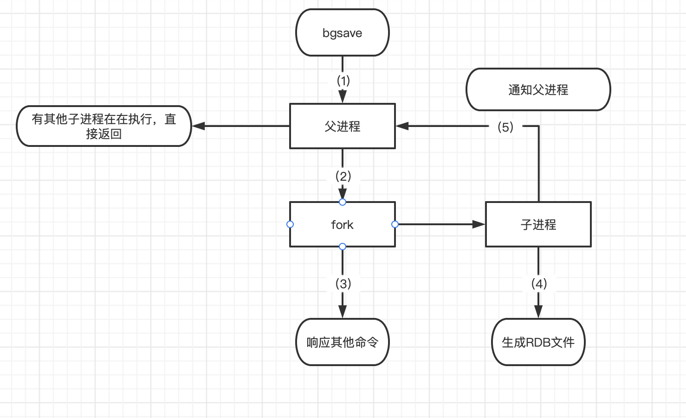
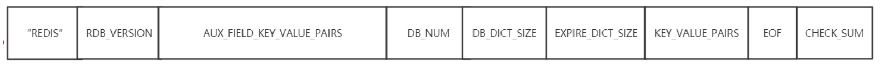

5W2H

Why:为什么需要持久化

What:什么是redis的持久化

Where:持久化在哪里

When: 何时触发持久化

Who: redis做持久化的是工作线程还是后台线程

How:如何持久化的

How much:持久化的消耗是什么


### 为什么Redis需要持久化

1. redis是内存数据库，宕机后数据会消失
2. redis重启后快速恢复数据，要提供持久化机制
3. redis持久化是为了快速恢复数据而不是为了存储数据
4. redis主从复制依赖持久化


注意：redis的持久化不保证数据的完整性

当redis用作DB时，DB数据要完整，所以一定要有一个完整的数据源（文件、mysql）

在系统启动时，从这个完整的数据源中将数据load到Redis中

数据量较小，不易改变，比如：字典库（XML,Table）


### redis如何实现持久化的

redis的持久化方式有两种：

1. RDB (Redis DataBase)
2. AOF (Append Only File)


##### RDB

RDB（Redis DataBase），是redis**默认**的存储方式，RDB方式是通过**快照**（snapshotting）完成的。只关注这一时刻的数据，不关注如何生成数据的。


**如何实现的**

Redis会通过fork函数创建一个**子进程**来完成数据的持久化


**何时会持久化**

触发RDB的方式有：

1. 符合自定义配置的快照配置
2. 执行save或者bgsave命令
3. 执行flushall命令
4. 执行主从复制操作（第一次）


**配置参数定期执行**

在redis.conf中配置：save       多少秒数据变了多少

```shell
save "" # 不使用RDB存储 不能主从
save 900 1 # 标识15分钟（900秒钟）内至少有1个键被更改则进行快照
save 300 100 # 标识5分钟(300秒) 内至少100个键被更改则进行快照
save 60 10000 # 标识1分钟内至少有10000个键被更改则进行快照
```


**命令显示触发**

在客户端输入bgsave命令


**RDB的执行流程（原理）**



1. Redis父进程首先判断:当前是否有子进程在执行持久化任务，如果在执行bgsave命令时直接返回。
2. 父进程执行**fork**（调用OS函数复制主进程）操作创建子进程，这个复制过程中**父进程是阻塞的**，redis不能响应来自客户端的命令。
3. 父进程fork后，bgsave命令返回“Background saving started”信息并不再阻塞父进程，并可以响应其他命令。
4. 子进程创建RDB文件，根据**父进程内存快照**生成临时快照文件，文件生成后对原有文件进行替换。
5. 子进程发送信号给父进程标识完成，父进程更新统计信息。


**RDB文件格式**



1. 头部5个字节固定为“REDIS”字符串

2. 4字节“RDB”版本号（不是Redis版本号),当前8，填充后为0008

3. 辅助字段，以key-value的形式

   | 字段名     | 字段值     | 字段名         | 字段值      |
   | ---------- | ---------- | -------------- | ----------- |
   | Redis-ver  | 5.0.5      | aof-preamble   | 是否开启aof |
   | redis-bits | 64/32      | repl-stream-db | 主从复制    |
   | ctime      | 当前时间戳 | repl-id        | 主从复制    |
   | used-mem   | 使用内存   | repl-offffset  | 主从复制    |

4. 存储数据库号码

5. 字典大小

6. 过期key

7. 主要数据，以key-value形式存储

8. 结束标识

9. 校验和，就是检查文件是否破损，否者是否被修改


**RDB的优缺点**

**优点**

1. RDB是二进制压缩文件，占用空间小，便于传输（传给slaver）
2. 主进程fork子进程，可以最大化Redis性能，主进程不能太多，Redis的数据不能太大，**复制过程占用多余内存，复制过程中主进程阻塞**

**缺点**

不保证数据完整性，可能会丢失最后一次快照之后更新的所有数据


#####AOF


### Q&A

Linux fork函数作用


如何监控redis的持久化

可以通过info命令查看