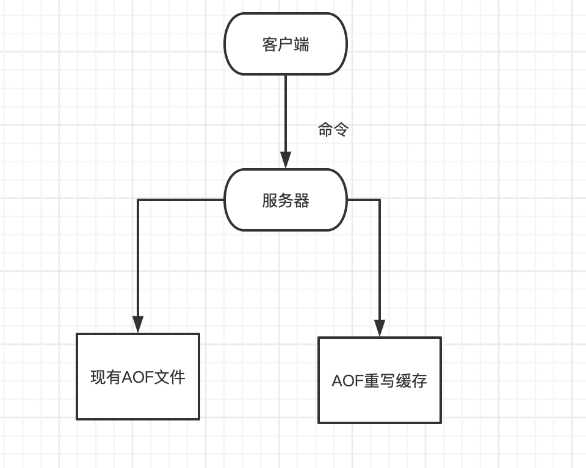
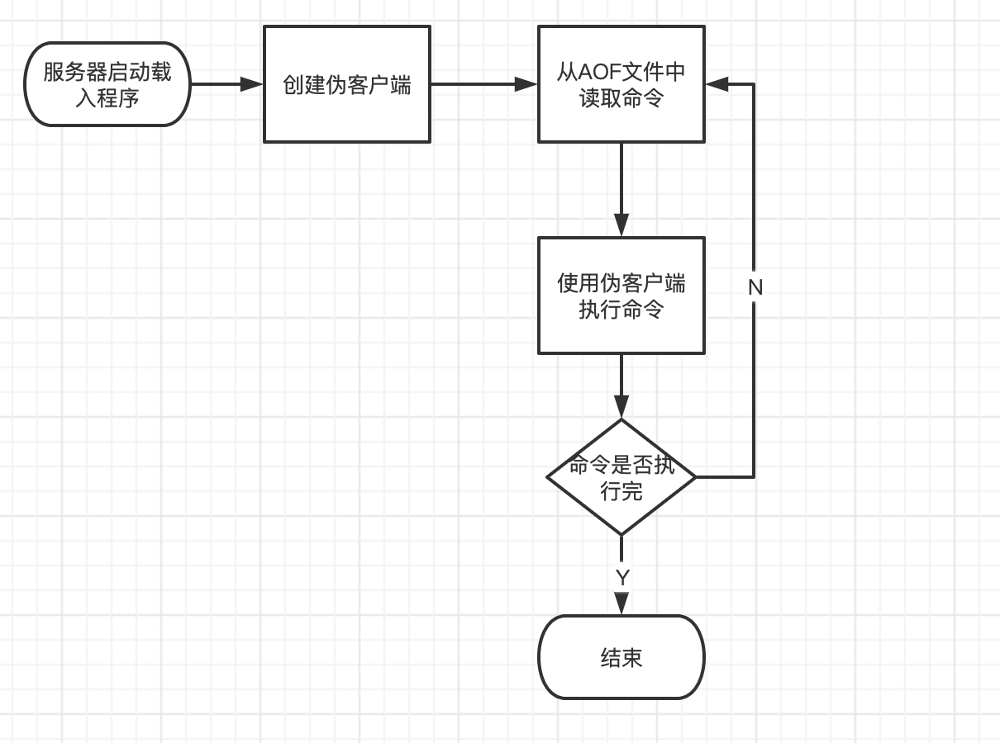

# 为什么Redis需要持久化

1. redis是内存数据库，宕机后数据会消失
2. redis重启后快速恢复数据，要提供持久化机制
3. redis持久化是为了快速恢复数据而不是为了存储数据
4. redis主从复制依赖持久化


注意：redis的持久化不保证数据的完整性

当redis用作DB时，DB数据要完整，所以一定要有一个完整的数据源（文件、mysql）

在系统启动时，从这个完整的数据源中将数据load到Redis中

数据量较小，不易改变，比如：字典库（XML,Table）


## redis如何实现持久化的

redis的持久化方式有两种：

1. RDB (Redis DataBase)
2. AOF (Append Only File)


### RDB

RDB（Redis DataBase），是redis**默认**的存储方式，RDB方式是通过**快照**（snapshotting）完成的。只关注这一时刻的数据，不关注如何生成数据的。


#### **如何实现的**

Redis会通过fork函数创建一个**子进程**来完成数据的持久化


#### **何时会持久化**

触发RDB的方式有：

1. 符合自定义配置的快照配置
2. 执行save或者bgsave命令
3. 执行flushall命令
4. 执行主从复制操作（第一次）


**配置参数定期执行**

在redis.conf中配置：save       多少秒数据变了多少

```shell
save "" # 不使用RDB存储 不能主从
save 900 1 # 标识15分钟（900秒钟）内至少有1个键被更改则进行快照
save 300 100 # 标识5分钟(300秒) 内至少100个键被更改则进行快照
save 60 10000 # 标识1分钟内至少有10000个键被更改则进行快照
```


**命令显示触发**

在客户端输入bgsave命令


#### **RDB的执行流程（原理）**


1. Redis父进程首先判断:当前是否有子进程在执行持久化任务，如果在执行bgsave命令时直接返回。
2. 父进程执行**fork**（调用OS函数复制主进程）操作创建子进程，这个复制过程中**父进程是阻塞的**，redis不能响应来自客户端的命令。
3. 父进程fork后，bgsave命令返回“Background saving started”信息并不再阻塞父进程，并可以响应其他命令。
4. 子进程创建RDB文件，根据**父进程内存快照**生成临时快照文件，文件生成后对原有文件进行替换。
5. 子进程发送信号给父进程标识完成，父进程更新统计信息。


**RDB文件格式**


1. 头部5个字节固定为“REDIS”字符串

2. 4字节“RDB”版本号（不是Redis版本号),当前8，填充后为0008

3. 辅助字段，以key-value的形式

   | 字段名     | 字段值     | 字段名         | 字段值      |
   | ---------- | ---------- | -------------- | ----------- |
   | Redis-ver  | 5.0.5      | aof-preamble   | 是否开启aof |
   | redis-bits | 64/32      | repl-stream-db | 主从复制    |
   | ctime      | 当前时间戳 | repl-id        | 主从复制    |
   | used-mem   | 使用内存   | repl-offffset  | 主从复制    |

4. 存储数据库号码

5. 字典大小

6. 过期key

7. 主要数据，以key-value形式存储

8. 结束标识

9. 校验和，就是检查文件是否破损，否者是否被修改


**RDB的优缺点**

**优点**

1. RDB是二进制压缩文件，占用空间小，便于传输（传给slaver）
2. 主进程fork子进程，可以最大化Redis性能，主进程不能太多，Redis的数据不能太大，**复制过程占用多余内存，复制过程中主进程阻塞**

**缺点**

不保证数据完整性，可能会丢失最后一次快照之后更新的所有数据


### AOF

AOF（append on file）是Redis的另一种持久化方式。Redis默认是不开启的。开启AOF持久化后，Redis将所有对数据库进行**写入的命令（及其参数）**（RESP   Redis Serialization Protocol）记录到AOF文件，以此达到记录数据库状态的目的。（就你做什么我都照这做呗）这样当Redis重启后只要按顺序回放这些命令就恢复到原始状态了。AOF会记录过程，RDB只管结果。


#### **如何开启AOF持久化**

配置 redis.conf

```shell
# 可通过修改redis.conf配置文件中的appendonly参数开启
appendonly yes
# AOF文件的保存位置和RDB文件的位置相同，都是通过dir参数设置的
dis ./
# 默认的文件名是appendonly.aof,可以通过appendFilename参数修改
appendfilename appendonly.aof
```


#### **AOF原理**

AOF文件存储的是redis命令，同步命令到AOF文件的整个过程可以分为三个阶段：

命令传播：Redis 将**执行完的命令**、命令的参数、命令的参数个数等信息发送到AOF程序中。

缓存追加：AOF 程序根据接收到的命令数据，将命令转化为网络通讯协议的格式，然后将协议内容追加到服务器的AOF缓存中。

文件写入和保存：AOF缓存中的内容被写入到AOF文件末尾，如果设定的AOF保存条件被满足的话，fsync函数或者fdatasync函数会被调用，将写入的内容真正的保存到磁盘中。


**命令传播**

当一个Redis客户端需要执行命令时，它通过网络连接，将协议文本发送给Redis服务器。服务器在接到客服端的请求之后它会根据协议文本的内容，选择适当的命令函数，并将各个参数从字符串文本转为 Redis 字符串对象(StringObject)。每当命令函数成功执行之后，命令参数都会被传播到AOF程序。

**缓存追加**

当命令被传播到AOF程序之后，程序后根据命令以及命令的参数，将命令从字符串对象转换会原来协议文本。协议文本生成之后，它会被追加到 redis.h/redisServer 结构的 aof_buf 末尾。

**redisServer**结构维持着Redis服务器的状态，**aof_buf**域则保存着所有等待写入AOF文件协议文本(RESP)。

**文件写入和保存**

每当服务器常规任务函数被执行、或者事件处理器被执行时，aof.c/flushAppendOnlyFile 函数都会被调用，这个函数执行一下两个工作：

1. write：根据条件，将 aof_buf 中的缓存写入到AOF文件。（AOF文件是内存对象）
2. save：根据条件，调用 fsync 或 fdatasync 函数，将AOF文件保存到磁盘中。


**AOF保存模式**

Redis 目前支持三种 AOF 保存模式，分别是：

- AOF_FSYNC_NO：不保存

- AOF_FSYNC_EVERYSEC：每一秒保存一次。（默认）

- AOF_FSYNC_ALWAYS：每执行一个命名保存一次。（不推荐，影响效率）


**不保存**（并不代表一直都不持久话，只是触发事件比较苛刻，不然开启AOF干啥）

在这种模式下，每次调用flushAppendOnlyFile 函数，write 都会被执行，但 save 会被忽略过。

在这种模式下，save 指挥在一下任何一种情况中被执行：

1. Redis 被关闭
2. AOF 功能被关闭
3. 系统的写缓存被刷新（可能是缓存已经被写满或者定期保存操作被执行）

注意：这三种情况下的save操作都会引起 **Redis 主进程阻塞**。


**每一秒保存一次**（一个时间段内的缓存，最后一起同步磁盘）

在这种模式中，save 原则上每隔一秒钟就会被执行一次，因为 save 操作是由后台子线程 (fork) 调用的，所以它不会引起服务器主进程阻塞。


**每执行一个命令保存一次**

在这种模式下，每执行完一个命令之后，write和save都会被执行。

另外，对比 AOF_FSYNC_EVERYSEC ，save 操作是由Redis 主进程,所以在SAVE执行期间，主进程会被阻塞，不能接受命令请求。


**AOF保存模式对性能和安全性的影响**

| 模式               | WRITE是否阻塞？ | SAVE是否阻塞？                 | 停机时丢失的数据                                |
| ------------------ | --------------- | ------------------------------ | ----------------------------------------------- |
| AOF_FSYNC_NO       | 阻塞(主进程)    | 阻塞（主进程）                 | 操作系统最后一次对AOF文件触发SAVE操作之后的数据 |
| AOF_FSYNC_EVERYSEC | 阻塞(主进程)    | 不阻塞父进程（子进程执行SAVE） | 一般情况下部超过2秒的数据                       |
| AOF_FSYNC_ALWAYS   | 阻塞(主进程)    | 阻塞(主进程)                   | 最多只丢失一个命令的数据                        |


#### **AOF重写、触发方式、混合持久化**

AOF记录数据的变化过程，越来越大，需要重写“瘦身”

Redis可以在AOF体积变化过大时，自动地在后台(Frok子进程)对AOF进行重写。重写后新的AOF文件包含了恢复当前数据所需的最小的命令集合。实际上，AOF重写并不需要对原有的AOF文件进行任何的写入和读取，它针对的是数据库中键的当前值。


Redis 不希望 AOF 重写造成服务器无法处理请求，所以 Redis 决定将 AOF 重写程序放到(后台)子进程里执行，这样处理的最大好处是：

1. 子进程进行AOF重写期间，主进程可以继续处理命令请求。
2. 子进程带有主进程数据副本，使用子进程而不是线程，可以在避免锁的情况下，保证数据的安全性。

问题

不过，使用子进程也有一个问题需要解决：因为子进程在进行AOF重写期间，主进程还需要继续处理命令，而新的命令可能对现有的数据进行修改，这会让当前数据库的数据和重写后的AOF文件中的数据不一致。

为了解决这个问题，Redis增加了一个 **AOF重写缓存**，这个缓存在fork出子进程之后开始启用，Redis 主进程在接到新的写命令之后，除了会将这个写命令的协议内容追加到现有的AOF文件之外，还会追加到这个缓存中。




**重写过程分析**

Redis 在创建新AOF文件的过程中，会继续将命令追加到现有 AOF 文件里面，即使重写过程中发生停机，现有的AOF文件也不会丢失。而一旦新 AOF 文件创建完毕，Redis 就会从旧 AOF文件切换到新 AOF 文件，并开始对新 AOF 文件进行追加操作。

当**子进程**在执行AOF重写时，**主进程**需要执行以下三个工作：

1. 处理命令请求
2. 将写命令追加到现有的AOF文件中。
3. 将写命令追加到AOF重写缓存中。

这样以来可以保证：

现有的AOF 功能会继续执行，即使在 AOF 重写期间发生停机，也不会有任何数据丢失。

所有对数据库进行修改的命令都会被记录到 AOF 重写缓存中。

当子进程完成 AOF 重写之后，它会向父进程发送一个完成信号，父进程在接到完成信号之后，会调用一个信号处理函数，并完成以下工作：

将AOF 重写缓存中的内容全部写入到新 AOF 文件中。

对新的AOF文件进行改名，**覆盖**原有的 AOF 文件。

Redis数据库里的数据+AOF重写过程中的命令——>新的AOF文件——>覆盖老的

当步骤1执行完毕之后，现有AOF文件、新AOF文件和数据库三者的状态就完全一致了。

当步骤2执行完毕之后，程序就完成了新旧两个AOF文件的交替。

这个信号处理函数执行完毕之后，主进程旧可以继续像往常一样接受命令请求了。在整个AOF后台重写过程中，只有最后的写入缓存和改名操作会造成主进程阻塞，在其他时候，AOF后台重写都不会对主进程造成阻塞，这将AOF重写对性能造成的影响降到了最低。

以上就是AOF后台重写，也即是BGREWRITEAOF命令（AOF重写）的工作原理。


##### 触发方式

1. 配置触发

   在redis.conf中配置

   ```shell
   # 表示当前aof文件大小超过上一次aof文件大小的百分之多少的时候会进行重写。如果之前没有重写过，已启动时aof文件大小为准
   auto-aof-rewrite-percentage 100
   
   # 限制允许重写最小aof文件大小，也就是文件大小小于64mb的时候，不需要进行优化
   auto-aof-rewrite-min-size 64mb
   ```

2. 执行bgrewriteaof命令


##### 混合次久化

RDB和AOF各有优缺点，Redis 4.0开始支持rdb和aof的混合持久化。如果把混合持久化打开，aofrewrite 的时候就直接rdb的内容写到aof文件开头。

RDB的头+AOF的身体——>appendonly.aof

开启混合持久化

```shell
aof-use-rdb-preamble yes
```


#### AOF文件的载入与数据还原


因为AOF文件里面包含了重建数据库状态所需的所有写命令，所以服务器只要读入并重新执行一遍AOF文件里面保存的写命令，就可以还原原服务器关闭之前的数据库状态。


Redis读取AOF文件并还原数据库状态的详情步骤如下：

1. 创建一个不带网络连接的伪客户端（fake client）：因为Redis的命令只能在客户端上下文中执行，而载入AOF文件时所使用的命令直接来源于AOF而不是网络连接，所以服务器使用了一个没有网络连接的伪客户端来执行AOF文件保存的写命令，伪客户端执行命令的效果和带网络连接的客户端执行的效果完全一样
2. 从AOF文件中分析并读取出一条写命令
3. 使用伪客户端执行被读出的写命令
4. 一直执行步骤2和步骤3，直到AOF文件中的所有写命令都被处理完毕为止

当完成以上步骤之后，AOF文件所保存的数据库状态就会被完整地还原出来，整个过程如下图所示：




### RDB与AOF对比

1. RDB存某个时刻的数据快照，采用**二进制压缩存储**，AOF存**操作命令**，采用文本存储（混合）

2. RDB性能高、AOF性能较低

3. RDB在配置触发状态会丢失最后一次快照更改的所有数据，AOF设置为每秒保存一次，则最多丢失2秒的数据

4. Redis以主服务器模式运行，RDB不会保存过期值对数据，Redis以从服务器模式运行，RDB会保存过期键值对，当主服务器像服务器向从服务器同步时，再清空过期键值对。

   AOF写入文件时，对过期的key会追加一条del命令，当执行AOF重写时，会忽略过期key和del命令。


### 应用场景

内存数据库 rdb+aof 数据不容易丢失

有原始数据源：每次启动都从原始数据源中初始化，则不用开启持久化（数据量小）

缓存服务器（数据不怎么变化）  rdb	一般性能高


### Q&A

Linux fork函数作用


如何监控redis的持久化


可以通过info命令查看


