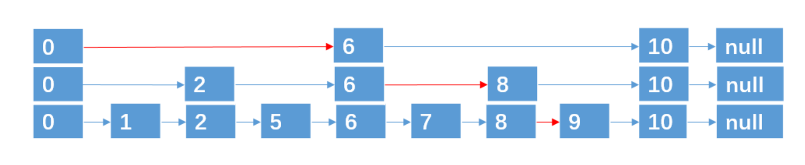

## RedisDB结构

Redis作为Key-Value存储系统，数据结构如下:


Redis 没有表的概念，Redis实例多对应的db以编号区分，db本身就是key的命名空间。

比如：user:1000作为key，表示在user这个命名空间下id为1000的元素，类似user表的id=1000的行。

<br>


Redis中存在“数据库”的概念，该结构由redis.h中的redisDb定义。

当redis 服务器初始化时，会预先分配16个数据库

所有数据库保存到结构 redisServer 的一个成员 redisServer.db 数组中

redisClient 中存在一个名叫db的指针指向当前使用的数据库

RedisDB结构体源码:

```c
typedef struct redisDb{
		int id ;  // id是数据库序号，为0-15（默认redis有16个数据库）
   	long avg_ttl; //存储的数据库对象的平均ttl(time to live)，用于统计
  	dict * dict;		//存储数据库所有的key-value
  	dict * expires;	//存储key的过期时间
  	dict * blocking_key;//blop 存储阻塞key和客户端对象
  	dict * ready_keys;//阻塞后push响应阻塞客户端 存储阻塞后push的key和客户端对象
  	dict * watched_keys;//存储watch监控的key和客户端对象
}
```

<br>

### id

id是数据库序号，为0-15（默认Redis有16个数据库）

### dict

存储数据库所有的key-value

### expires

存储key的过期时间

## ReidsObject结构

Value是一个对象

包含字符串对象，列表对象，哈希对象，集合对象和有序集合对象

### 结构信息概览

```c
typedef struct redisObject{
  unsigned type:4;//类型 对象类型
  unsigned encoding:4;//编码
  void * ptr;//指向底层实现数据结构的指针
  //...
  int refcount;//引用计算
  //...
  unsigned lru:LRU_BITS; // LRU_BITS为24bit 记录最后一次被命令程序访问的时间
  //...
}robj;
```

#### 4位type

type字段表示对象的类型，占4位；

REDIS_STRING(字符串)、REDIS_LIST（列表）、REDIS_HASH(哈希)、REDIS_SET(集合)、REDIS_ZSET(有序集合)。

当我们执行type命令时，便是通过读取 RedisObject 的type 字段获取对象类型

```shell
> type a1
string
```

#### 4位encoding

encoding表示对象的内部编码，占4位

每个对象有不同的实现编码

Redis 可以根据不同的使用场景来为对象设置不同的编码，大大提高了 Redis 的灵活性和效率。

通过 object encoding 命令，可以查看对象采用的编码方式

```shell
> type a1
string
> object encoding a1
embstr
> get a1
xxx
```

#### 24位LRU

lru 记录的是对象最后一次被命令程序访问的时间

高16位存储一个分钟数界别的时间戳，低8位存储访问计数(lfu:最近访问次数)

lru——>高16位：最后被访问的时间

lfu——>低8位: 最后被访问次数

#### refcount

refcount记录的是该对象被引用的次数，类型为整型。

refcount的作用，主要在与对对象的引用计数和内存回收。

当对象的refcount>1时，称为共享对象

Redis为了节省内存，当有一些对象重复出现时，新的程序不会创建新的对象，而是仍然使用原来的对象。

#### ptr

ptr 指针指向具体的数据，比如:set hello world, ptr指向包含字符串 world 的SDS。


<br>

### 7种类型

#### 字符串对象

C语言：字符数组 "\0"

Redis使用了SDS（Simple Dynamic String）。用于存储字符串和整型数据。


```c
struct sdshdr{
 		// 记录buf数组中已经使用的字节的数量
  	int len;
  	// 记录 buf 数组中为使用字节的数量
  	int free;
  	//字符数组，用于保存字符串
  	char buf[];
}
```

buf[]的长度=len+free+1

SDS的优势：

1. SDS在C字符串的基础上加入了free和len字段，获取字符串长度：SDS时O(1)，C字符串时O(n)。buf数组的长度=free+len+1

2. SDS由于记录了长度，在可能造成缓冲区溢出时会自动重新分配内存，杜绝了缓冲区溢出。

3. 可以存取二进制数据，以字符串长度len来作为结束标识。

   C:\0 空字符串 二进制数据包包括空字符串，所以没有办法存储二进制数据

   SDS ：非二进制 \0

   ​			二进制：字符串长度 可以存二进制数据

使用场景：

SDS的主要应用在：存储字符串和整型数据、存储key、AOF缓冲区和用户输入缓冲。

#### 跳跃表

跳跃表是**有序集合**（sorted-set）的底层实现，效率高，实现简单。

跳跃表的基本思想：

将有序链表中的部分节点分层，每一层都是一个有序链表。

**查找**

在查找时优先从最高层开始向后查询，当达到某个节点时，如果next节点的值大于要查找的值或next指针指向null，则从当前节点下降一层继续向后查找。

举例：


查找元素9，按道理我们需要从头节点开始遍历，一共遍历8个节点才能找到元素9。

第一次分层：

遍历5次找到元素9


第二次分层：

遍历4次找到元素9



第三次分层：

遍历4次找到元素9


这种数据结构，就是跳跃表，它具有二分查找的功能。

**删除**

找到指定元素并删除每层的该元素即可

跳跃表的特点：

每层都是一个有序链表

查找次数近似层数（1/2）

底层包含所有元素

空间复杂度O(n)扩充了一倍

**Redis跳跃表底层实现**


```c
// 跳跃表节点
typedef struct zskiplistNode{
  sds ele; // 存储字符串类型数据 redis3.0版本中使用robj类型表示，redis4.0.1中直接使用sds类型表示
  double score;//存储排序的分值
  struct zskiplistNode * backward;// 后退指针，指向当前节点的**最底层**的前一个节点
  
  struct zskiplistLevel{
    	struct zskiplistNode *forward;//指向本层下一个节点
    	
    	unsigned int span;// 本层下个节点到本节点的元素个数
  }level [];
}

// 链表
typedef struct zskiplist{
  	// 表头节点和表为节点
  	struct skiplistNode *header,*tail;
  	// 表中节点的数量
  	unsigned long length;
  	// 表中层数最大的节点的层数
  	int level;
}zskiplist;
```

完整的跳跃表结构体：


跳跃表的优势：

1. 可以快速查找到需要的节点O(logn)
2. 可以在O(1)的时间复杂度下，快速获得跳跃表的头节点、尾节点、长度和高度。

应用场景：有序集合的实现


#### 字典

字典dict又称散列表(hash)，是用来存储键值对的一种数据结构。

Redis整个数据库是用字典来存储的。（K-V结构）

对Redis进行CURD操作其实就是对字典中的数据进行CURD操作。

<Br>

**数组**

数组：用来存储数据的容器，采用头指针+偏移量的方式能够以O(1)的时间复杂度定位数据所在的内存地址。

Reids海量存储 快


<Br>

**Hash函数**

hash（散列），作用是把任意长度的输入通道通过散列算法转换成固定类型、固定长度的散列值。

hash函数把Redis里的key：包括字符串、整型、浮点数统一转换成整型。

key=100.1 String “100.1” 5位长度的字符串

Redis-cli：times 33

Redis_Server:MurmurHash

**数组下标**=hash(key)%数组容量(hash值%数组容量得到余数)

<Br>

**Hash冲突**

不同的key经过计算后出现的数组下标一致的情况，称为hash冲突。

采用单链表在相同的下表位置处存储原始key和value

当根据key找value时，找到数组下标，遍历单链表可以找出key相同的value


<Br>

**Redis字典实现**

Redis字典实现包括：字典(dict)、Hash表(dictht)、Hash表节点(dictEntry)。


**Hash表**

```c
typedef struct dictht{
  dictEnery **table;	//哈希表数组
  unsigned long size;	//哈希表数组的大小
  unsigned long sizemask;	//用于映射位置的掩码，值永远等于(size-1)
  unsigned long used;			//哈希表已有节点的数量，包含next单链表数据
}
```

